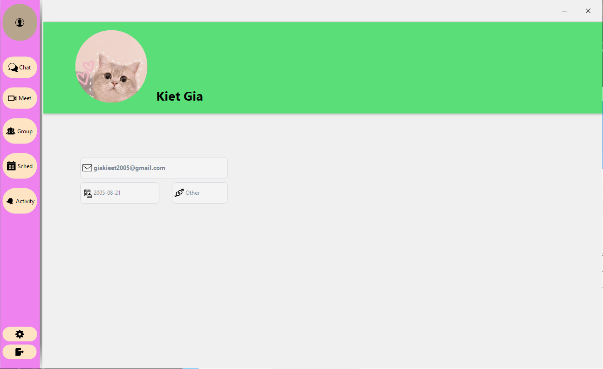
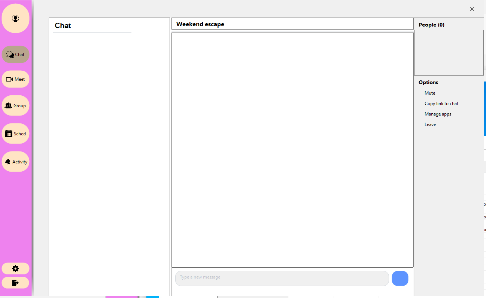

# 📚 Online Learning Application - Ứng dụng học tập trực tuyến
  


**Đồ Án Môn học:** Lập trình mạng căn bản <br>
**Mã môn học:** NT106.Q14 <br>
**Nhóm:** 13 <br>


---
## 👥 Thành viên nhóm
| Họ và tên             | MSSV     | Email                  |
|------------------------|----------|------------------------|
| Phùng Gia Kiệt         | 23520818 | 23520818@gm.uit.edu.vn |
| Nguyễn Phát Đạt        | 23520258 | 23520258@gm.uit.edu.vn |
| Trần Như Cương         | 23520209 | 23520209@gm.uit.edu.vn |
| Nguyễn Đức Bình An     | 24520055 | 24520055@gm.uit.edu.vn |
| Lê Huy Hiếu            | 24520493 | 24520493@gm.uit.edu.vn |

---

## 📝 Giới thiệu
**Online Learning Application** là ứng dụng hỗ trợ quản lý khóa học, giảng viên, sinh viên và lịch học một cách trực quan.  

- Sinh viên có thể dễ dàng đăng ký môn học, xem thông tin khóa học, thời khóa biểu.  
- Giảng viên có thể quản lý lớp học, cập nhật tài liệu và điểm.  
- Dự án được phát triển dựa trên kiến thức môn học **NT106.Q14 – Lập trình mạng căn bản**.  

---

## 💡 Tính năng chính
- Quản lý danh sách khóa học (thêm / sửa / xóa / tìm kiếm).  
- Quản lý thông tin sinh viên, giảng viên.  
- Quản lý đăng ký môn học.  
- Xem thời khóa biểu và lịch học.  
- Giao diện thân thiện, trực quan.  
- Dữ liệu lưu trữ tập trung (**SQL Server 2022 + SSMS 21**).
---

## 🛠️ Công cụ và công nghệ  
| Thành phần | Công nghệ |
|-------------|------------|
| **Ngôn ngữ** | C# (.NET Framework) |
| **Giao diện (UI)** | WinForms + Guna UI 2 |
| **Cơ sở dữ liệu** | SQL Server 2022 |
| **Quản lý CSDL** | SQL Server Management Studio (SSMS 21) |
| **Quản lý mã nguồn** | GitHub |
| **IDE** | Visual Studio 2022 |

---
## ⚙️ Cài đặt & Sử dụng
### 🔧 Yêu cầu môi trường  
Để chạy được ứng dụng **Online Learning Application (WinForms - C#)**, máy của bạn cần:  

| Thành phần | Mô tả / Phiên bản khuyến nghị |
|-------------|-------------------------------|
| 💻 Hệ điều hành | Windows 10 hoặc mới hơn |
| 🧱 Visual Studio | **Visual Studio 2022** (hoặc 2019) |
| ⚙️ Workload | `.NET desktop development` (để chạy WinForms C#) |
| 🔧 .NET Framework / SDK | .NET Framework **4.7.2+** hoặc .NET **6.0 SDK** (tùy dự án) |
| 🗄️ SQL Server | SQL Server 2022 + SQL Server Management Studio (SSMS 21) |
| 🔗 Git | Để clone và quản lý mã nguồn từ GitHub |
### 🚀 Cách chạy dự án 
1. Clone repo về máy:  
   ```bash
   git clone https://github.com/TeikaiG05/NT106_CoursesManager_PJ.git
2. Mở solution bằng Visual Studio:  
   ```bash
   CourseManager.sln
3. Nhấn Start để chạy Client (Tương tự với Server).

---

## 🔀 Branches
...

---

## 🧭 Hướng dẫn sử dụng và giao diện ứng dụng
### Client:
Sau khi khởi động ứng dụng **Online Learning Application**, bạn có thể thao tác các chức năng sau:

#### 🔑 1. Đăng nhập hệ thống
- Mở ứng dụng, màn hình **Login** sẽ hiển thị.  
- Nhập **tên đăng nhập (username)** và **mật khẩu (password)**.  
- Tài khoản mặc định (demo):

| Tài khoản | Mật khẩu |
|------------|-----------|
| admin      | admin     |

<p align="center">
  
</p>

#### 📝 2. Đăng ký tài khoản
- Chọn **Đăng ký (Sign up)** ở giao diện đăng nhập.  
- Điền thông tin cá nhân: họ tên, ngày sinh, giới tính, email, mật khẩu, xác nhận mật khẩu.  
- Nhấn **Đăng ký** → Hệ thống tự động lưu vào cơ sở dữ liệu.  
- Sau khi đăng ký thành công, ứng dụng sẽ quay lại màn hình đăng nhập.
- 
<p align="center">
  
</p>

#### 📊 3. Giao diện Dashboard
Sau khi đăng nhập, bạn sẽ thấy **màn hình chính (Dashboard)**:
##### 👤 Hồ sơ người dùng (User Profile)
- Hiển thị thông tin người dùng đang đăng nhập.  
- Gồm các trường:
  - 📧 Email người dùng.
  - 📅 Ngày sinh.  
  - Ảnh đại diện (avatar).

<p align="center">
  
</p>

##### 💬 Giao diện Chat
- Cho phép người dùng trao đổi tin nhắn trong thời gian thực với các người dùng khác.
- Giao diện gồm 2 phần chính:
  - Danh sách người dùng / cuộc trò chuyện (bên trái): hiển thị tên, trạng thái online/offline.
  - Khung chat chính: hiển thị nội dung tin nhắn, ô nhập, và nút gửi.
- Tin nhắn của người dùng hiện bên phải, tin nhắn nhận được hiện bên trái.
<p align="center">  </p>

##### Các module khác: 
> *Sẽ được cập nhật trong tương lai...*

---

## 📸 Demo

> *Sẽ được cập nhật trong tương lai...* 
 
---
✨ *Made by Group13_NT106.Q14 | NT106 - DoAn*
